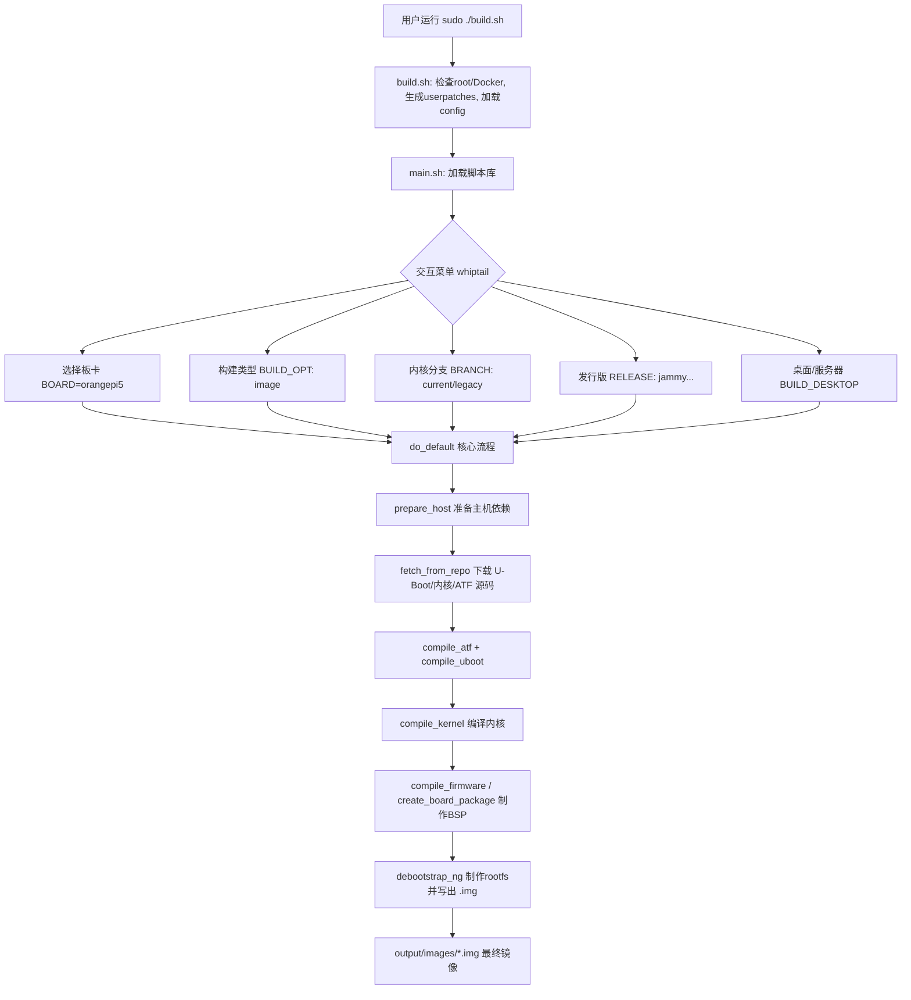

# Orange Pi 官方构建系统（orangepi-build）教学总结

> 本文档以教学为目的，系统讲解 `orangepi-build` 仓库的**目录结构**、**构建原理**，以及**从零构建一份 Orange Pi 5 镜像**的完整步骤。
>
> `orangepi-build` 本质上是 **Armbian 构建框架** 的定制分支（fork），用 Bash 脚本自动完成：下载源码 → 编译 U-Boot/ATF/内核 → 制作根文件系统（rootfs）→ 打包成可烧录的 `.img` 镜像。

---

## 一、项目整体架构

```
orangepi-build/
├── build.sh            # 唯一入口脚本（用户只需运行它）
├── README.md           # 支持的板卡 / 主机系统说明
├── LICENSE             # GPL v2
├── scripts/            # 所有构建逻辑（Bash 脚本库）
├── external/           # 所有“数据”：配置、缓存、补丁、打包资源
└── output/             # 构建产物（首次运行后自动生成，含镜像/deb/日志）
```

设计思想：**逻辑（`scripts/`）与数据（`external/`）分离**。
- `scripts/` 是“引擎”，几乎不需要改动。
- `external/` 是“配置与素材”，决定“为哪块板子、用什么内核、装哪些包”。
- 用户的个性化改动放在 `userpatches/`（首次运行自动生成，不在版本控制内）。

---

## 二、顶层文件/目录逐一说明

| 路径 | 作用 |
|------|------|
| `build.sh` | **构建入口**。负责：检查 root 权限、处理 Docker/Vagrant 模式、安装基础依赖、生成 `userpatches/`、加载配置文件，最后进入 `scripts/main.sh`。 |
| `README.md` | 列出支持的 SoC/板卡清单，以及要求的主机系统（Ubuntu 22.04）。 |
| `scripts/` | 构建流程的全部 Bash 逻辑（见第三节）。 |
| `external/` | 板卡配置、内核 defconfig、补丁、板级支持包、下载缓存等（见第四节）。 |
| `output/` | 运行后生成。包含 `images/`（最终 `.img`）、`debs/`（编译出的 deb 包）、`cache/`（rootfs 缓存）、`debug/`（日志）。 |
| `userpatches/` | 运行后生成。放用户自定义配置（`config-*.conf`）、自定义补丁、`lib.config` 覆盖等。 |

---

## 三、`scripts/` 目录详解（构建引擎）

| 脚本 | 职责 |
|------|------|
| `general.sh` | **通用工具函数库**。`display_alert`（彩色日志）、`fetch_from_repo`（git 拉取源码）、`prepare_host`（安装/检查主机依赖）、清理、下载工具链等。 |
| `main.sh` | **主流程编排**。加载其它脚本库 → 通过 `whiptail` 弹出交互菜单（选板卡、构建类型、内核分支、发行版、桌面/服务器）→ 执行核心函数 `do_default()`。 |
| `configuration.sh` | 根据所选 `BOARD` 加载板卡与 SoC 家族配置，设置 `ARCH`、内核/U-Boot 源地址与分支、rootfs 参数等全局变量。 |
| `compilation.sh` | **编译核心**：`compile_uboot`、`compile_atf`、`compile_kernel`、`compile_firmware` 等，负责打补丁并交叉编译。 |
| `debootstrap.sh` | **制作根文件系统**：`debootstrap_ng()` 用 `debootstrap` 创建基础 Debian/Ubuntu 系统、装内核/BSP、生成分区并最终写出 `.img` 镜像。 |
| `distributions.sh` | 各发行版（bullseye/bookworm/focal/jammy…）的差异化系统配置（软件源、locale、服务等）。 |
| `desktop.sh` | 桌面环境（XFCE/KDE 等）软件包安装与配置。 |
| `makeboarddeb.sh` | 生成 **BSP（板级支持包）** deb：`orangepi-bsp-cli-<board>`，包含启动脚本、设备树、板级脚本等。 |
| `chroot-buildpackages.sh` | 在 chroot 环境中编译额外的第三方软件包。 |
| `image-helpers.sh` | 镜像相关辅助函数（分区、挂载、写 bootloader、压缩镜像等）。 |
| `pack-uboot.sh` | 打包 U-Boot 相关产物。 |
| `extensions.sh` | **扩展/钩子系统**，允许在构建各阶段插入自定义逻辑（`call_extension_method`）。 |
| `build-all-ng.sh` | 批量构建：按 `targets.conf` 一次性构建多块板卡/多种镜像。 |
| `build-cix-image.sh` | Cix P1（Orange Pi 6）专用镜像流程。 |
| `fel-load.sh` | 全志（Allwinner）平台通过 USB FEL 模式加载启动（调试用）。 |

---

## 四、`external/` 目录详解（配置与素材）

### 4.1 `external/config/` —— 构建配置中心

| 子项 | 作用 |
|------|------|
| `boards/*.conf` | **每块板卡一个配置文件**。如 [external/config/boards/orangepi5.conf](external/config/boards/orangepi5.conf) 定义板名、SoC 家族、U-Boot defconfig、设备树、内核分支等。 |
| `sources/families/*.conf` | **SoC 家族配置**。如 `rockchip-rk3588.conf` 定义 RK3588 系列的 U-Boot/内核 git 分支、编译器版本、CPU 频率、BSP 系统微调等。 |
| `sources/*.conf` | 架构级 BSP 配置（`arm64.conf`、`armhf.conf`、`riscv64.conf`）。 |
| `kernel/*.config` | **内核 defconfig**。如 `linux-rockchip-rk3588-current.config`（6.1 内核）、`linux-rockchip-rk3588-legacy.config`（5.10 内核）。 |
| `bootenv/` | U-Boot 启动环境变量模板。 |
| `bootscripts/` | `boot.cmd` 启动脚本（编译成 `boot.scr`）。 |
| `cli/` `desktop/` | 各发行版下 命令行版 / 桌面版 的软件包清单。 |
| `distributions/` | 按发行版代号（bullseye/jammy…）组织的系统配置。 |
| `fex/` | 全志平台 FEX 板级配置（RK 平台不用）。 |
| `optional/` | 可选的设备树 overlay、附加包等。 |
| `templates/` | 模板文件：`config-example.conf`、`Dockerfile`、`Vagrantfile`。 |
| `torrents/` | 工具链/rootfs 缓存的种子文件（用于 BT 加速下载）。 |
| `targets*.conf` | 批量构建时的目标清单。 |
| `aptly*.conf` `armbian.key` | APT 仓库管理与签名密钥。 |

### 4.2 `external/cache/` —— 下载与构建缓存（加速重复构建）

| 子项 | 作用 |
|------|------|
| `sources/` | git clone 下来的源码（`orangepi-config`、`tinyalsa`、蓝牙工具等）。内核/U-Boot 源码也缓存在此。 |
| `debs/` | 预编译好的 `.deb` 包，按架构/平台分目录（`arm64/`、`h618/`、`rk3399/`、`riscv64/`…）。 |
| （运行时生成）`toolchain/` `rootfs/` | 交叉编译工具链、rootfs 压缩缓存。 |

> 缓存机制让二次构建大幅加速：已存在的 deb/源码不会重复下载或编译。

### 4.3 `external/packages/` —— 打进镜像的素材与待编译包

| 子项 | 作用 |
|------|------|
| `bsp/` | **板级支持包素材**：各 SoC 的 overlay、脚本、`orangepi5plus/`、`rk3588/` 等平台专属文件，会 rsync 进根文件系统。 |
| `blobs/` | 二进制素材（开机 logo、splash 等）。 |
| `orangepi/` | `orangepi-config`、deb 打包脚本（`builddeb`、`mkdebian`）等。 |
| `pack-uboot/` | U-Boot 打包所需资源。 |
| `plymouth-theme-orangepi/` | 开机动画（Plymouth）主题。 |
| `raspi/` | 树莓派兼容相关包。 |
| `extras-buildpkgs/` | 需要额外编译的软件包定义。 |

### 4.4 `external/patch/` —— 补丁

| 子项 | 作用 |
|------|------|
| `atf/` | ARM Trusted Firmware 补丁。 |
| `misc/` | 杂项补丁。 |
| （家族相关）内核/U-Boot 补丁 | 按 `KERNELPATCHDIR`（如 `rockchip-rk3588-current`）在编译前自动应用。 |

### 4.5 `external/extensions/` —— 构建扩展

独立的功能扩展脚本：`grub.sh`（GRUB 引导）、`flash-kernel.sh`、`sunxi-tools.sh`、`rkbin-tools.sh`（瑞芯微 rkbin 工具）等，通过钩子在合适阶段被调用。

---

## 五、构建流程原理（数据流）



**核心函数 `do_default()`（位于 [scripts/main.sh](scripts/main.sh)）依次执行：**
1. `prepare_host` — 安装主机构建依赖、准备目录。
2. `fetch_from_repo` — 下载 U-Boot、内核、ATF、RK 打包资源等源码。
3. `compile_atf` / `compile_uboot` — 编译引导加载器（若对应 deb 不存在）。
4. `compile_kernel` — 打补丁并交叉编译内核，产出内核 deb。
5. 编译 BSP 及配套包：`orangepi-config`、`orangepi-zsh`、`orangepi-firmware`、`create_board_package`。
6. `debootstrap_ng` — 创建根文件系统、安装上述 deb、分区并生成最终 `.img`。

---

## 六、构建 Orange Pi 5 镜像 —— 完整步骤

Orange Pi 5 = RK3588S SoC，板卡配置名 **`orangepi5`**，SoC 家族 **`rockchip-rk3588`**，支持内核分支 **`legacy`（5.10）** 与 **`current`（6.1）**。

### 6.0 前置要求（主机环境）
- **操作系统**：Ubuntu 22.04（Jammy）x86_64 —— 官方唯一直接支持的主机系统。
- **权限**：需要 `root`（脚本会自动 `sudo`）。
- **磁盘**：建议 ≥ 50 GB 空闲空间。
- **内存**：建议 ≥ 4 GB（编译内核较吃内存）。
- **网络**：需能访问 GitHub（国内可在配置中设 `DOWNLOAD_MIRROR="china"` 走清华镜像）。
- 若主机**不是 Ubuntu 22.04**（如 macOS、其它发行版），请使用 **Docker 方式**（见 6.4）。

### 6.1 获取源码
```bash
git clone https://github.com/orangepi-xunlong/orangepi-build.git
cd orangepi-build
```
> 必须完整 clone 整个仓库，脚本依赖 `scripts/` 与 `external/` 的完整目录结构。

### 6.2 方式 A：交互式构建（推荐新手）
```bash
sudo ./build.sh
```
随后按弹出的菜单依次选择：
1. **Board（板卡）**：选 `orangepi5`
2. **Compile（构建类型）**：选 `image`（Full OS image for flashing，完整可烧录镜像）
   - 其它选项：`u-boot`（只编引导）、`kernel`（只编内核）、`rootfs`（只做根文件系统与 deb 包）。
3. **Kernel configuration（是否改内核配置）**：一般选 `no`（不进 menuconfig）。
4. **Kernel branch（内核分支）**：
   - `current` = 6.1 内核（**推荐，支持最好**）
   - `legacy` = 5.10 内核（老稳定版）
5. **Release（发行版基底）**：如 `jammy`（Ubuntu 22.04）、`bookworm`（Debian 12）、`bullseye`、`focal` 等。
6. **Image type（镜像类型）**：
   - `Image with console interface (server)` = 服务器版（无桌面）
   - `Image with desktop environment` = 桌面版
7. 若选服务器版，再选 **Standard（标准）** 或 **Minimal（最小）**。

构建完成后，镜像位于：
```
output/images/OrangePi5_<版本>_<发行版>_<分支>_<内核版本>[ _desktop ].img
```

### 6.3 方式 B：非交互式构建（可脚本化/CI）
一条命令直接指定所有参数，无需菜单：
```bash
# 服务器版（jammy, 6.1 current 内核）
sudo ./build.sh BOARD=orangepi5 BRANCH=current BUILD_OPT=image \
     RELEASE=jammy BUILD_MINIMAL=no BUILD_DESKTOP=no KERNEL_CONFIGURE=no

# 桌面版（bookworm, 6.1 current 内核）
sudo ./build.sh BOARD=orangepi5 BRANCH=current BUILD_OPT=image \
     RELEASE=bookworm BUILD_MINIMAL=no BUILD_DESKTOP=yes \
     KERNEL_CONFIGURE=no DESKTOP_ENVIRONMENT=xfce \
     DESKTOP_ENVIRONMENT_CONFIG_NAME=config_base
```
> 每次构建结束，脚本会打印一行 “Repeat Build Options”，把当次所用参数原样给出，便于复现。

### 6.4 方式 C：Docker 构建（非 Ubuntu 主机 / 环境隔离）
```bash
sudo ./build.sh docker
```
- 首次会根据 `userpatches/Dockerfile` 构建镜像，之后在容器内执行同样的交互流程。
- 也可结合非交互参数：`sudo ./build.sh docker BOARD=orangepi5 BRANCH=current BUILD_OPT=image RELEASE=jammy BUILD_DESKTOP=no BUILD_MINIMAL=no KERNEL_CONFIGURE=no`。
- 相关命令：`dockerpurge`（清理旧容器/镜像后再构建）、`docker-shell`（进容器交互 shell）。

### 6.5 常用配置项（写进 `userpatches/config-default.conf` 可免菜单）
参考模板 [external/config/templates/config-example.conf](external/config/templates/config-example.conf)：

| 变量 | 含义 | 示例 |
|------|------|------|
| `BOARD` | 板卡 | `orangepi5` |
| `BRANCH` | 内核分支 | `current` / `legacy` |
| `RELEASE` | 发行版 | `jammy` / `bookworm` / `bullseye` / `focal` |
| `BUILD_OPT` | 构建目标 | `image` / `kernel` / `u-boot` / `rootfs` |
| `BUILD_DESKTOP` | 是否桌面版 | `yes` / `no` |
| `BUILD_MINIMAL` | 是否最小化 | `yes` / `no` |
| `KERNEL_CONFIGURE` | 是否进内核菜单 | `no` |
| `DOWNLOAD_MIRROR` | 下载镜像源 | `china`（清华源，国内更快） |
| `USE_TORRENT` | BT 加速缓存下载 | `yes` |
| `COMPRESS_OUTPUTIMAGE` | 是否压缩输出镜像 | `no` / `sha,gpg,7z` |
| `CLEAN_LEVEL` | 清理级别 | `debs,oldcache` |

---

## 七、烧录到 SD 卡 / eMMC

构建产物是标准 `.img`，用任意烧录工具写入即可（**注意 `/dev/sdX` 必须是你的 SD 卡设备，写错会损坏硬盘数据**）：

```bash
# 方式一：dd（Linux/macOS）
sudo dd if=output/images/OrangePi5_xxx.img of=/dev/sdX bs=1M status=progress conv=fsync

# 方式二：图形工具
# 使用 balenaEtcher / Raspberry Pi Imager 选择该 .img 烧录
```
烧录完成后插入 Orange Pi 5，上电即可从 SD 卡启动。默认用户通常为 `orangepi`（或首次开机按提示创建）。

> **macOS 烧录**：`diskutil list` 找到 SD 卡（如 `/dev/disk4`）→ `diskutil unmountDisk /dev/disk4` → `sudo dd if=output/images/<名>/<名>.img of=/dev/rdisk4 bs=4m status=progress`（用 `rdisk` 比 `disk` 快很多）。

---

## 八、在 macOS 上用 Docker/Colima 构建（实战踩坑与修复）

`orangepi-build` 是 **Linux 专用**（官方只支持 Ubuntu 22.04）。在 macOS 上**原生运行会失败**：系统自带 Bash 3.2（脚本需要 4+ 的 `declare -A`），且缺少 `whiptail`/`flock`/`losetup`/`systemd-detect-virt` 以及 loop 设备等 Linux 内核特性。

**解决思路**：在 **privileged 的 Ubuntu 22.04 容器**里构建。Apple Silicon 上 Colima 提供 `aarch64` Linux VM，而 Orange Pi 5 也是 `arm64` → **原生编译，无需 QEMU**。

### 8.1 一条命令（推荐）
仓库根目录的 [orangepi5-docker-build-macos.sh](../orangepi5-docker-build-macos.sh) 把下面所有修复封装成一个**幂等**脚本：
```bash
colima start --cpu 4 --memory 8 --disk 100    # 先确保 Colima 在跑
bash orangepi5-docker-build-macos.sh          # server / jammy / current
BUILD_DESKTOP=yes RELEASE=bookworm bash orangepi5-docker-build-macos.sh
CLEAN_LEVEL=debs,oldcache bash orangepi5-docker-build-macos.sh   # 强制全量重编
```
它会：建容器 → 装依赖 → 装 `losetup` 补丁 → 跑 `build.sh` → 把镜像/日志拷回 `./output`。

### 8.2 必踩的坑与修复（在裸 `ubuntu:22.04` 上）
| 现象 | 根因 | 修复 |
|------|------|------|
| `declare: -A: invalid option`、`syntax error` | macOS Bash 3.2 | 在 Linux 容器里跑 |
| `sudo: command not found`、locale 报错 | 精简镜像没有 `sudo`/`locales` | `apt install sudo locales`（脚本已做） |
| `Partition fail` → `sfdisk: command not found` | `prepare_host` 依赖表漏了 `fdisk` | `apt install fdisk util-linux` |
| `Device node /dev/loop0p1 does not exist` | VM 内核 loop **内置且 `max_part=0`**，`losetup -P` 不建分区节点，且内置无法重载 | 装 `kpartx` + 一个 `losetup` 垫片：`-P` 时用 `kpartx -as` 造 `/dev/mapper/loopNpM` 并软链到 `/dev/loopNpM` |
| `systemd-detect-virt`/`lsb_release: not found` | 容器未被识别 | 非致命；显式传 `NO_APT_CACHER=yes` |

> `losetup` 垫片是关键，脚本会写入容器 `/usr/local/bin/losetup`，对仓库脚本零改动。

### 8.3 缓存持久化（docker volume）
整个编译目录 `/root/orangepi-build`（源码、编好的 debs、rootfs 缓存）放进**命名卷 `opi-build-tree`**，由 Docker 存在 Colima VM 的原生 ext4 上（比 virtiofs 快，且 rootfs/chroot/mknod 的属主正确）：

| 操作 | 编译状态 | 是否重编 |
|------|------|------|
| `docker stop` → `start`（同容器） | 保留（可写层） | 否 |
| `colima stop` → `start`（关 VM） | 保留 | 否 |
| **`docker rm`（删容器）** | **卷仍在** → 重建容器挂回即可 | **否**（这正是命名卷的价值） |
| `docker volume rm opi-build-tree` | 删除 | 是 |

要点：`CLEAN_LEVEL=""` 复用已编 debs（约 1 分钟出镜像）；默认模板 `CLEAN_LEVEL="debs,oldcache"` 会删 debs → 重编内核。产物与日志通过 bind mount 落到 Mac 的 `output/`。

---

## 九、串口调试（debug UART）

### 9.1 参数（RK3588 关键）
- 设备：`ttyS2`（UART2）；**波特率 `1500000` 8N1**（来自 [boot-rk3588.cmd](../external/config/bootscripts/boot-rk3588.cmd#L27) 的 `console=ttyS2,1500000`）。
- **最常见的“无输出”原因就是波特率用了 115200**，应为 `1500000`。

### 9.2 接线（3 针专用调试口，不是 40 针排针）
| Orange Pi 5 | ↔ | USB‑TTL |
|---|---|---|
| `GND` | → | `GND` |
| `TX` | → | `RX`（交叉） |
| `RX` | → | `TX`（交叉） |

不要接 3.3V/5V；按板上丝印匹配。

### 9.3 macOS 上读串口
macOS 的 `screen`/`stty` **无法设置 1500000**（`tcsetattr: Invalid argument`，这本身就是很多人“无输出”的原因）。用 **`tio`**（`brew install tio`）：
```bash
tio -b 1500000 /dev/cu.usbserial-XXXX        # 退出：Ctrl-t 再 q
```

### 9.4 无输出排查顺序
1. **波特率** 必须 1500000（乱码=波特率错；完全无字符=接线/引脚错）。
2. **TX/RX 交叉**（最常见），并确认共 `GND`。
3. **回环测试**：拔离板子，把 USB‑TTL 自己的 `RX`↔`TX` 短接，在 `tio` 里打字有回显 → 适配器/波特率没问题，故障在板子侧接线。
4. **确认接的是 3 针调试口**（UART2），不是 40 针上的其它 UART。
5. **终极判断**：SSH 里 `sudo reboot`，同时 `tio` 抓取——U‑Boot/内核启动日志与登录 getty 无关，一定会打印；全程空白就是硬件/接线问题。

---

## 十、快速回顾（TL;DR）

1. **目录**：`scripts/` = 构建逻辑；`external/` = 配置与素材（`config/boards` 选板、`config/kernel` 内核配置、`packages/bsp` 板级文件、`cache` 缓存、`patch` 补丁）；`build.sh` = 入口；`output/` = 产物。
2. **原理**：`build.sh → main.sh → do_default()`：准备主机 → 下载源码 → 编 U-Boot/ATF → 编内核 → 做 BSP → `debootstrap` 做 rootfs → 输出 `.img`。
3. **构建 Orange Pi 5**（Ubuntu 22.04 主机）：
   ```bash
   git clone https://github.com/orangepi-xunlong/orangepi-build.git
   cd orangepi-build
   sudo ./build.sh BOARD=orangepi5 BRANCH=current BUILD_OPT=image \
        RELEASE=jammy BUILD_DESKTOP=no BUILD_MINIMAL=no KERNEL_CONFIGURE=no
   ```
4. **macOS（Colima/Docker）**：`bash orangepi5-docker-build-macos.sh`（已封装容器、依赖、`losetup` 补丁、`docker volume` 缓存持久化）。
5. **产物**在 `output/images/*.img`，用 `dd` 或 balenaEtcher 烧到 SD 卡即可启动；串口调试用 `tio -b 1500000`。
