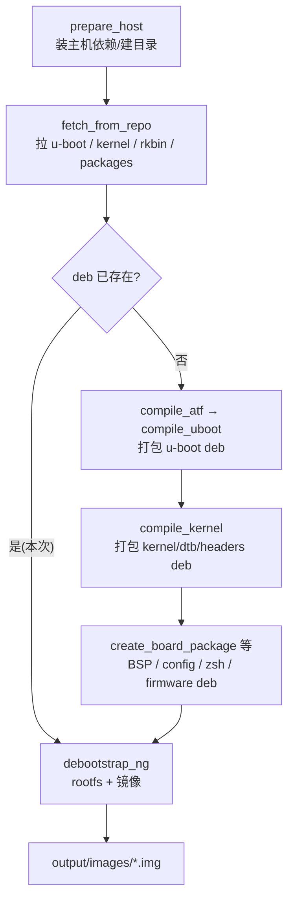

# Orange Pi 5 镜像构建过程详解（结合构建日志）

> 目标：**读懂 Orange Pi 5 的 `.img` 是怎么一步步被 build 出来的**。本文把 [output/build.log](../output/build.log) 的每个阶段，对应到 `orangepi-build` 里**真实的脚本函数、源码位置、编译命令与产物**，并给出每个“模块”的目录分析。
>
> 本次构建参数：`BOARD=orangepi5 BRANCH=current(6.1) RELEASE=jammy BUILD_OPT=image`，SoC 家族 `rockchip-rk3588`。因为 debs 已缓存（`CLEAN_LEVEL=""`），日志里**编译阶段被跳过**、直接复用 deb，所以整轮只花了 1 分钟——但下面仍完整讲解“从零”会发生什么。

---

## 一、五大模块总览

一份可启动镜像 = **引导链 + 内核 + 根文件系统**，`orangepi-build` 把它拆成 5 个模块，各自独立编译成 **`.deb`**，最后再组装进 `.img`：

| 模块 | 作用 | 源码/素材位置 | 编译函数 | 产物 |
|------|------|------|------|------|
| **ATF**（ARM Trusted Firmware） | EL3 固件 `BL31`（安全监控、PSCI） | `external/cache/sources/rkbin-tools`、补丁 `external/patch/atf` | `compile_atf` [compilation.sh:29](../scripts/compilation.sh#L29) | `bl31.elf`（喂给 U-Boot） |
| **U-Boot** | 引导器（SPL + proper），初始化 DDR、加载内核 | 源码 `u-boot/<分支>`；defconfig `orangepi_5_defconfig` | `compile_uboot` [compilation.sh:113](../scripts/compilation.sh#L113) | `linux-u-boot-current-orangepi5_*.deb` |
| **Kernel** | Linux 内核 + 模块 + 设备树 | 源码 `kernel/<分支>`；`.config` = `external/config/kernel/linux-rockchip-rk3588-current.config`；补丁 `external/patch/kernel/rockchip-rk3588-current` | `compile_kernel` [compilation.sh:372](../scripts/compilation.sh#L372) | `linux-image-*`、`linux-dtb-*`、`linux-headers-*.deb` |
| **BSP**（板级支持包） | 启动脚本、`/boot` 配置、板级服务、`orangepi-config`/`zsh`/`firmware` | `external/packages/bsp/**`、`external/config/bootscripts` | `create_board_package` [makeboarddeb.sh](../scripts/makeboarddeb.sh) | `orangepi-bsp-cli-orangepi5_*.deb` 等 |
| **rootfs + image** | debootstrap 造根文件系统 → 装上面所有 deb → 分区/格式化/写引导 → 出 `.img` | `scripts/debootstrap.sh`、`distributions.sh`、包清单 `external/config/cli` | `debootstrap_ng` [debootstrap.sh:23](../scripts/debootstrap.sh#L23) | `output/images/<名>/<名>.img` |

---

## 二、总编排：`do_default()`

入口链：`build.sh` → `scripts/main.sh` → **`do_default()`**（[main.sh](../scripts/main.sh)）。它是“总导演”，顺序如下：



对应源码判断（[main.sh](../scripts/main.sh)，简化）：
```bash
[[ ! -f $DEB_STORAGE/${CHOSEN_UBOOT}_..deb ]]  && compile_atf && compile_uboot   # deb 在就跳过
[[ ! -f $DEB_STORAGE/${CHOSEN_KERNEL}_..deb ]] && compile_kernel
... create_board_package / compile_orangepi-config / -zsh / -firmware ...
debootstrap_ng     # 最后组装
```
> **本次日志**里 `u-boot`/`kernel` 的 deb 已在卷缓存中，所以看不到编译，只看到后面 `debootstrap_ng` 的过程；唯一现编的是 `orangepi-plymouth-theme`（deb 之前不存在）。

---

## 三、逐阶段详解（对照日志）

### 阶段 0 · 入口与配置
```
[ o.k. ] Using config file [ userpatches/config-example.conf ]
[ o.k. ] Command line: setting BOARD to [ orangepi5 ] ...
[ o.k. ] Extension being added [ rkbin-tools :: ... rockchip64_common.inc:5 ]
[ o.k. ] Extension manager [ processed 3 Extension Methods ... ]
```
- `build.sh` 加载配置 → `main.sh` 处理命令行 `X=Y` 覆盖。
- `configuration.sh` `source` 板卡配置 [external/config/boards/orangepi5.conf](../external/config/boards/orangepi5.conf) 与家族 [rockchip-rk3588.conf](../external/config/sources/families/rockchip-rk3588.conf)，确定：`BOOTCONFIG=orangepi_5_defconfig`、`KERNELBRANCH=orange-pi-6.1-rk35xx`、`LINUXCONFIG=linux-rockchip-rk3588-current`、`BOOT_SCENARIO=spl-blobs`。
- **扩展系统**（[extensions.sh](../scripts/extensions.sh)）：家族配置里 `enable_extension "rkbin-tools"` 注册了瑞芯微 `rkbin` 工具的钩子（提供 ATF/DDR blob）。

### 阶段 1 · prepare_host
```
[ o.k. ] Preparing [ host ]
[ o.k. ] Build host OS release [ jammy ]
[ o.k. ] Running in container [ docker ]
[ warn ] apt-cacher is disabled in containers ...
```
- `prepare_host()`（[general.sh](../scripts/general.sh#L1406)）装齐主机端交叉编译/打包依赖，识别到容器环境（`systemd-detect-virt`）后设 `CONTAINER_COMPAT=yes`、禁用 apt-cacher。

### 阶段 2 · 下载源码
```
[ o.k. ] Downloading sources
[ o.k. ] Checking git sources [ /root/orangepi-build/u-boot v2017.09-rk3588 ]  → Up to date
[ o.k. ] Checking git sources [ /root/orangepi-build/kernel orange-pi-6.1-rk35xx ] → Up to date
[ o.k. ] Checking git sources [ .../external/cache/sources/rk35xx_packages ... ]
[ o.k. ] Checking git sources [ .../external/cache/sources/rkbin-tools rkbin ]
```
- `fetch_from_repo()`（[general.sh:497](../scripts/general.sh#L497)）：浅克隆（`git init`+`fetch --depth 200`）到
  - U-Boot → `u-boot/v2017.09-rk3588`
  - 内核 → `kernel/orange-pi-6.1-rk35xx`
  - rkbin/额外包 → `external/cache/sources/...`
- “Up to date” = 命中缓存，不重复下载。

### 阶段 3 · ATF + U-Boot（从零时才发生）
函数 `compile_uboot()`（[compilation.sh:113](../scripts/compilation.sh#L113)）核心命令：
```bash
# 1) 先把 ATF 产物 bl31.elf / DDR blob 拷进 u-boot 源码目录（spl-blobs 方案）
# 2) 配置 + 编译
make $BOOTCONFIG CROSS_COMPILE="$CCACHE $UBOOT_COMPILER"      # orangepi_5_defconfig
make $CTHREADS   CROSS_COMPILE="$CCACHE $UBOOT_COMPILER"      # 生成 idbloader / u-boot.itb
```
- 补丁：`advanced_patch "u-boot" ...` 应用 `external/patch/u-boot/**`。
- 打包：`pack-uboot.sh` 把 `idbloader.img`/`u-boot.itb` 收进 `linux-u-boot-current-orangepi5_1.2.2_arm64.deb`（装进镜像后由 `write_uboot` 写盘）。

### 阶段 4 · 内核（从零时才发生）
函数 `compile_kernel()`（[compilation.sh:372](../scripts/compilation.sh#L372)）：
```bash
# 1) 打补丁
advanced_patch "kernel" "rockchip-rk3588-current" ...        # external/patch/kernel/<dir>
# 2) 放置 .config（defconfig）
cp external/config/kernel/linux-rockchip-rk3588-current.config  .config
make ARCH=arm64 ... olddefconfig
# 3) 编译（arm64 主机上是“原生编译”，无需 QEMU/交叉链）
make -j.. ARCH=arm64 CROSS_COMPILE="$CCACHE " \
     LOCALVERSION="-rockchip-rk3588" Image modules dtbs
```
- **关键**：日志 `dpkg-architecture -e arm64` 为真 → **Native compilation**（Colima 是 aarch64，直接用系统 gcc，快）。
- 产物打成三个 deb：`linux-image-*`（内核+模块）、`linux-dtb-*`（设备树）、`linux-headers-*`。

### 阶段 5 · BSP / 配套 deb
```
[ o.k. ] Building deb [ orangepi-plymouth-theme ]     # 本次唯一现编的
```
- `create_board_package()`（[makeboarddeb.sh](../scripts/makeboarddeb.sh)）把 `external/packages/bsp/**`、启动脚本 `external/config/bootscripts/boot-rk3588.cmd`、`/boot` 配置等打成 `orangepi-bsp-cli-orangepi5_*.deb`。
- 另有 `compile_orangepi-config`/`-zsh`/`compile_firmware` 生成对应 all-arch deb。

### 阶段 6 · rootfs + 镜像 = `debootstrap_ng()`
这是日志里最长的一段，函数在 [debootstrap.sh:23](../scripts/debootstrap.sh#L23)。

**6.1 建 rootfs（缓存优先）**
```
[ o.k. ] Starting rootfs and image building process for [ current orangepi5 jammy ... ]
[ o.k. ] Extracting jammy-cli-arm64.d4c...0ea.tar.lz4 [ 0 days old ]
```
- 先按 9/10 内存挂 **tmpfs**（在 RAM 里做 rootfs，快）。
- `create_rootfs_cache()`（[debootstrap.sh:141](../scripts/debootstrap.sh#L141)）：命中就**解压缓存** `external/cache/rootfs/jammy-cli-arm64-*.tar.lz4`；没命中则 `bootstrap()` 现造：
  ```bash
  debootstrap --arch arm64 --components main --include gnupg,ca-certificates jammy ...
  ```

**6.2 装发行版/板级/内核 deb（在 chroot 里）**
```
[ o.k. ] Applying distribution specific tweaks for [ jammy ]
[ .... ] Installing [ linux-u-boot-current-orangepi5_..deb ]
[ .... ] Installing [ linux-image-current-rockchip-rk3588_..deb ]
[ .... ] Installing [ linux-dtb-.. / orangepi-bsp-cli-.. / orangepi-firmware / orangepi-config / orangepi-zsh ]
[ o.k. ] Enabling serial console [ ttyFIQ0 ]
[ o.k. ] Building kernel splash logo [ jammy ]
```
- `install_distribution_specific`（[distributions.sh](../scripts/distributions.sh)）+ `install_common`：设软件源、locale、服务；用 `install_deb_chroot()`（[image-helpers.sh:199](../scripts/image-helpers.sh#L199)）把阶段 3–5 的 deb 装进 chroot。
- `Enabling serial console ttyFIQ0` = 给 RK3588 开串口 getty（对应你之前调试的 `ttyS2@1500000`）。

**6.3 额外包 + 用户定制**
```
[ .... ] Installing [ wiringpi-2.58-1.deb ]  ... wiringOP submodules
[ .... ] Installing extras-buildpkgs [ hostapd htop mmc-utils ]
[ o.k. ] Calling image customization script [ customize-image.sh ]
[ o.k. ] No longer needed packages [ purge ]     # apt autoremove
```
- `chroot_installpackages_local`（[chroot-buildpackages.sh](../scripts/chroot-buildpackages.sh)）装 `external/packages/extras-buildpkgs`。
- `customize_image` 调 `userpatches/customize-image.sh`（用户注入定制的口子）。

**6.4 造镜像文件 = `prepare_partitions()` + `create_image()`**
```
[ o.k. ] Preparing image file for rootfs [ orangepi5 jammy ]
[ o.k. ] Current rootfs size [ 1765 MiB ] → Creating blank image [ 2336 MiB ]
[ o.k. ] Creating partitions [ root: ext4 ]
[ .... ] Creating rootfs [ ext4 on /dev/loop0p1 ]
[ .... ] Copying files to [ / ] / [ /boot ]
[ .... ] Updating initramfs... [ update-initramfs -uv -k 6.1.99-rockchip-rk3588 ]
[ o.k. ] Writing U-boot bootloader [ /dev/loop0 ]
[ o.k. ] SHA256 calculating [ Orangepi5_..img ]
[ o.k. ] Done building [ output/images/.../Orangepi5_..img ]
```
- `prepare_partitions()`（[debootstrap.sh:449](../scripts/debootstrap.sh#L449)）：`dd` 造空 `.raw` → `sfdisk` 分区 → `losetup -P` 挂环回 → `mkfs.ext4` 格式化 `${LOOP}p1` → `mount`。
  > 在 Colima 上 `losetup -P` 不建分区节点（`max_part=0`），靠我们装的 **`losetup` 垫片**用 `kpartx` 造出 `/dev/loop0p1`（日志能走到 `ext4 on /dev/loop0p1` 就证明生效）。
- `create_image()`（[debootstrap.sh:820](../scripts/debootstrap.sh#L820)）：`rsync` 把 rootfs 拷进挂载点（`/` 与 `/boot`）→ `update_initramfs` → `write_uboot $LOOP`（[image-helpers.sh](../scripts/image-helpers.sh) 把 idbloader/u-boot.itb `dd` 到镜像固定偏移）→ 卸载 →（可选压缩）→ 算 SHA256 → 落地 `output/images/<名>/<名>.img`。

---

## 四、各模块目录/代码位置速查

| 模块 | 源码 | 配置 | 补丁 | 编译/打包脚本 | 产物 deb |
|------|------|------|------|------|------|
| ATF | `external/cache/sources/rkbin-tools` | 家族 `.conf` 的 `ATFSOURCE/BOOT_SCENARIO` | `external/patch/atf` | [compilation.sh:29](../scripts/compilation.sh#L29) | 内嵌进 u-boot |
| U-Boot | `u-boot/<分支>` | `external/config/boards/orangepi5.conf`(`BOOTCONFIG`) | `external/patch/u-boot` | [compilation.sh:113](../scripts/compilation.sh#L113) + `pack-uboot.sh` | `linux-u-boot-current-orangepi5` |
| Kernel | `kernel/<分支>` | `external/config/kernel/linux-rockchip-rk3588-current.config` | `external/patch/kernel/rockchip-rk3588-current` | [compilation.sh:372](../scripts/compilation.sh#L372) | `linux-image/-dtb/-headers-*` |
| BSP | `external/packages/bsp/**` + `external/config/bootscripts` | `external/config/bootenv` | — | [makeboarddeb.sh](../scripts/makeboarddeb.sh) | `orangepi-bsp-cli-orangepi5` |
| rootfs | 缓存 `external/cache/rootfs` | 包清单 `external/config/cli`、`distributions/` | — | [debootstrap.sh](../scripts/debootstrap.sh)、[distributions.sh](../scripts/distributions.sh) | —（直接进镜像） |
| image | — | — | — | `prepare_partitions`/`create_image`、[image-helpers.sh](../scripts/image-helpers.sh) | `output/images/*.img` |

---

## 五、为什么这次只用 1 分钟（加速机制）

1. **deb 复用**：`CLEAN_LEVEL=""` 不删 `output/debs`，`do_default` 检测到 u-boot/kernel/bsp deb 已存在 → **跳过全部编译**（省掉最贵的 ~15 分钟内核编译）。
2. **rootfs 缓存**：`external/cache/rootfs/jammy-cli-arm64-*.tar.lz4` 命中 → 直接解压，免 `debootstrap` 联网造根。
3. **git 浅缓存**：源码 “Up to date”，不重复拉取。
4. **原生 arm64**：Colima 是 aarch64，内核/包**原生编译**，无需 QEMU。
5. **tmpfs**：rootfs 组装在内存盘里，I/O 快。
6. **docker volume 持久化**：以上缓存都在命名卷 `opi-build-tree`，`docker rm` 也不丢（见 [OrangePi5-构建教程总结.md](OrangePi5-构建教程总结.md) §八）。

---

## 六、一句话总结

`do_default()` 依次 **准备主机 → 拉源码 →（编 ATF/U-Boot/内核/BSP 成 deb）→ `debootstrap_ng` 造 rootfs 并把 deb 装进去 → `prepare_partitions`/`create_image` 分区格式化写引导 → 出 `.img`**。每个模块**代码在 `scripts/`、素材在 `external/`、产物是 `.deb`**，最终由 `debootstrap.sh` 组装成可烧录镜像。
